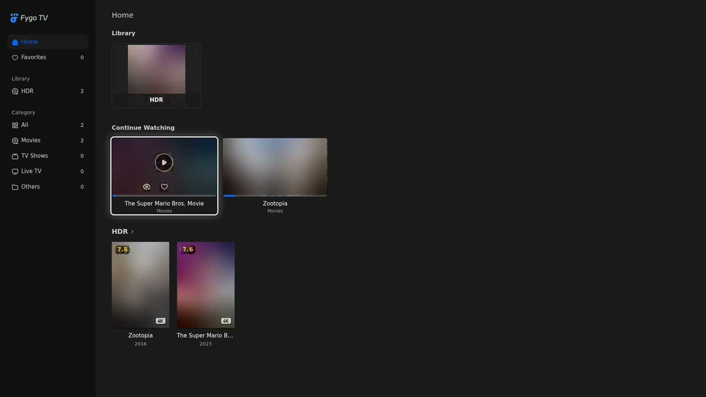
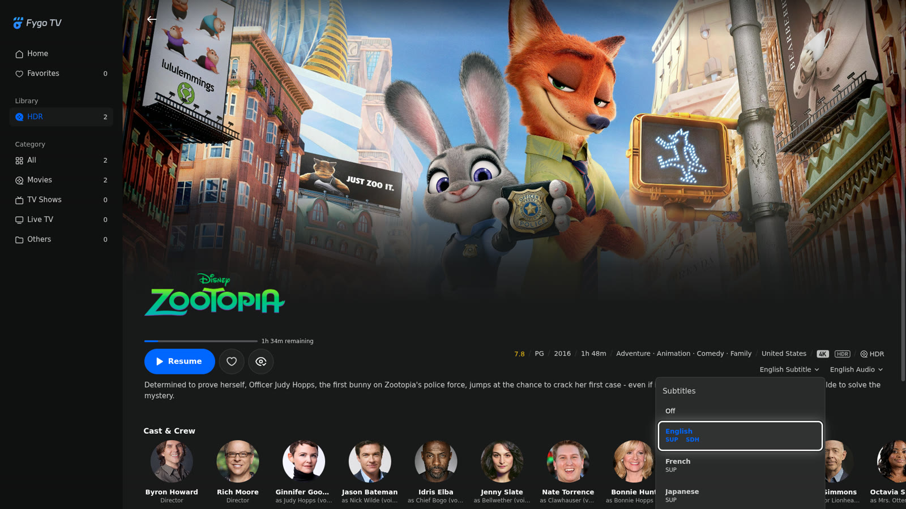
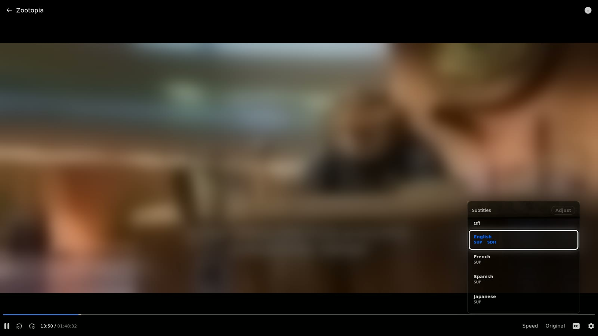
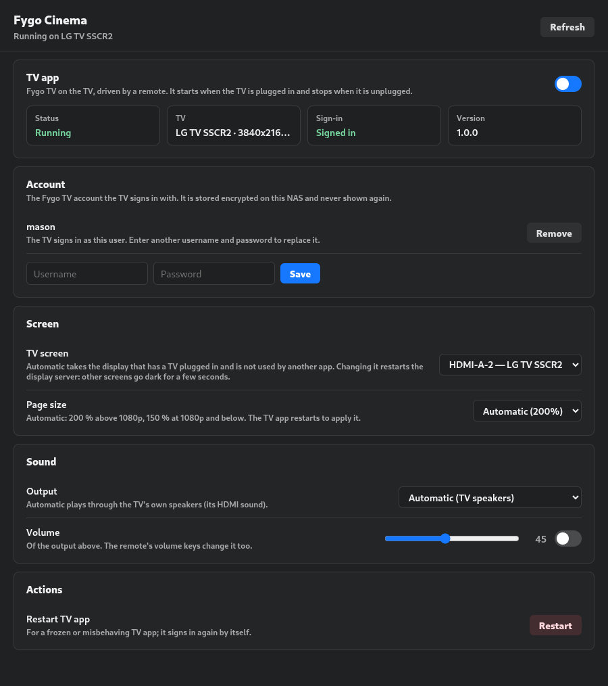
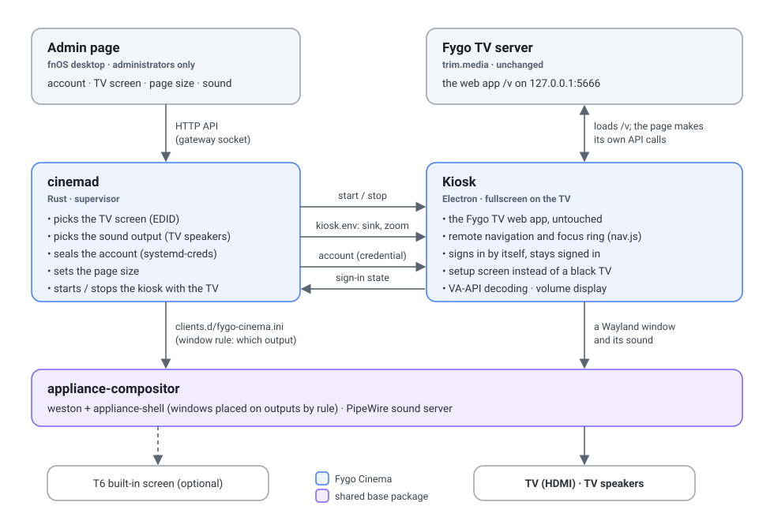

# Fygo Cinema: 飞牛影视直接接电视

[English](README.md) · **中文**

接上电视机直接看飞牛影视。NAS 自带的飞牛影视网页版全屏显示在接到 NAS 的电视上，用遥控器（或键盘）操作，支持硬件解码。

## 截图

以 1920×1080 截取。白色的框是遥控器移动的焦点。

| | |
|---|---|
|  |  |
| **首页。** 每张卡片、每个分区标题、侧栏的每一项都能用方向键选到。 | **详情页。** OK 打开选择菜单，焦点落在当前选项上；Back 关闭。 |
|  |  |
| **播放器。** 上 / 下键呼出控制栏：倍速、清晰度、字幕、设置。 | **音量。** 遥控器的音量键调节电视音量。 |
|  |  |
| **提示页。** 还没有账户、登录失败或连不上服务器时显示，不会让电视黑屏。 | **管理页。** 在 fnOS 桌面中打开，仅限管理员。 |

## 功能

- **遥控器导航**：每个页面都能用方向键、OK、Back 和 Home 操作，并显示焦点框。播放器的控制栏和菜单也能用遥控器操作。
- **硬件解码**：支持 4K HEVC 10bit HDR，在 Core Ultra 5 125H 上约占 17% CPU。
- **自动登录**：使用在管理页填写的账户，重启后仍保持登录。
- **跟随电视**：插上电视就启动，拔下就停止；声音从电视扬声器播放；页面大小按屏幕自动调整。
- **不怕误操作**：遥控器碰不到管理和账户相关的按钮。缺少什么时，电视会提示下一步该做什么，而不是黑屏（只有在管理页关闭应用时才会黑屏）。

## 系统要求

- FygoOS / fnOS 1.2 或更新版本，Intel 显卡。（AMD/英伟达显卡未测试）
- **飞牛影视**（`trim.media`），在应用中心安装。
- **[Appliance Compositor](https://github.com/jiaaom/appliance-compositor)**：在它自己的 [Releases 页面](https://github.com/jiaaom/appliance-compositor/releases) 下载。
- 接在 NAS 的 HDMI 或 DisplayPort 口上的电视（或显示器），以及一个遥控器或键盘（蓝牙或 USB 均可）。

Fygo Cinema 可以和 T6 Front Panel 同时运行（后者可选）：两者都是 [appliance-compositor](https://github.com/jiaaom/appliance-compositor) 里的窗口，共用同一个显示和声音服务。

## 安装

1. 下载最新的 [`appliance-compositor.fpk`](https://github.com/jiaaom/appliance-compositor/releases/latest/download/appliance-compositor.fpk) 和 [`fygo-cinema.fpk`](https://github.com/jiaaom/fygo-cinema/releases/latest/download/fygo-cinema.fpk)。
2. 在应用中心 → 手动安装中，先安装 `appliance-compositor.fpk`，再安装 `fygo-cinema.fpk`。
3. 在 fnOS 桌面打开 **Fygo Cinema**，填写电视要登录的飞牛影视账户。
4. 插上电视，飞牛影视就会出现在电视上。

还没有在设置里填写账户时，电视上会显示同样的步骤，并附上 NAS 地址的二维码。

## 工作原理



- **kiosk**（Electron）显示原封不动的飞牛影视网页版，并补上电视需要的部分：遥控器导航、自动登录、音量、提示页。
- **cinemad**（Rust）提供管理页，负责选择电视屏幕和声音输出，并随电视的插拔启动和停止 kiosk。

详见 [docs/architecture.md](docs/architecture.md)（英文）。

## 如需自行构建

```sh
(cd kiosk && npm ci)          # kiosk 自带的 Electron
packaging/build-fpk.sh        # → build/fygo-cinema.fpk
```

需要 [`fygopack`](https://developer.fygonas.com/docs/cli/fygopack/) 和 cargo。

## 文档

文档为英文：

- [Architecture](docs/architecture.md)：各组成部分、各自的作用、NAS 上的文件。
- [Web app integration](docs/web-app-integration.md)：每个页面上的遥控器行为、它依赖飞牛影视的哪些部分，以及飞牛影视更新后的复测清单。
- [Development](docs/development.md)：仓库结构、运行 cinemad 和测试用 kiosk、手动部署。
- [History](docs/history.md)：放弃的 Android 方案，以及为什么改用网页版。

## 许可证

MIT（见 `LICENSE`）。提示页使用了飞牛影视的登录页背景和 logo，以及 [qrcode-generator](https://github.com/kazuhikoarase/qrcode-generator)（MIT，Kazuhiko Arase）。
